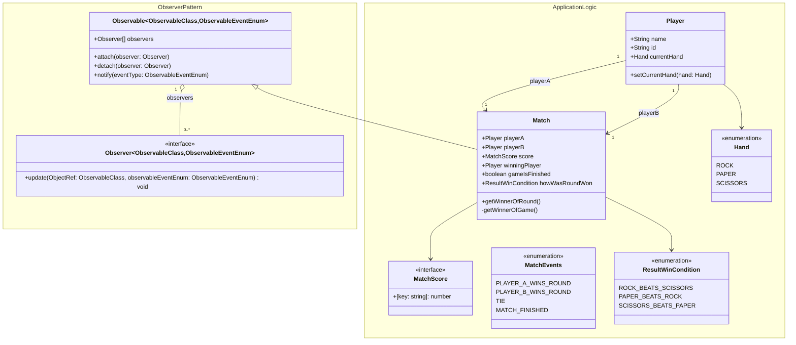
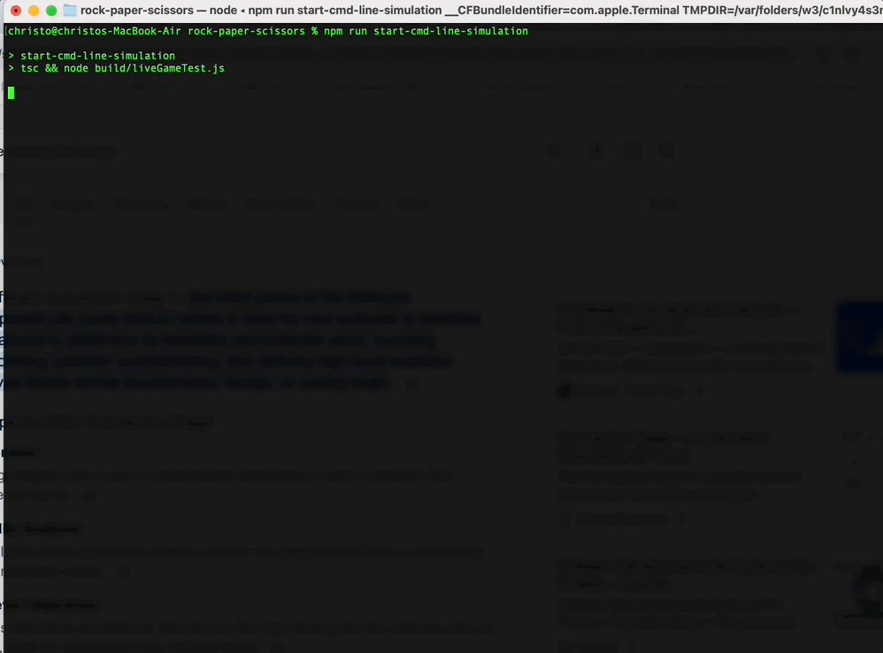

# rock-paper-scissors application model

basic rock, paper, scissors API you can use to write your own RPS apps with!

## class diagram/design of object oriented model

the idea is for the design of the model/application logic to be fairly simple and not overly verbose, so you can easily test it and "hook" into its state using the observer pattern to write your own applications and view layers, e.g: web gui/CLI gui or a web socket application etc...



## game api

```typescript
import { Player, hands, Match, MatchEvents, Hand } from ".";
import { Observer } from "./observerPattern";

// game api test
const playerA = new Player(
    "bob", // player name
    Math.random().toString(), // unique player id
    hands[Math.floor(Math.random() * hands.length)], // initial rock, paper, scissors hand
);
const playerB = new Player(
    "max", // player name
    Math.random().toString(), // unique player id
    hands[Math.floor(Math.random() * hands.length)], // initial rock, paper, scissors hand
);

const matchA = new Match(playerA, playerB);

class YourUI implements Observer<Match, MatchEvents> {
    constructor() {}
    update(currentGameStateObjectRef: Match, observableEventEnum: MatchEvents) {
        // get notified of changes to match state and event types here,
        // and update the UI accordingly
        switch (observableEventEnum) {
            case MatchEvents.PLAYER_A_WINS_ROUND:
                // player A won the round, update the UI accordingly
                console.log(`player A: ${currentGameStateObjectRef.getWinnerOfRound()} wins the round`);
                break;
            case MatchEvents.PLAYER_B_WINS_ROUND:
                // player B won the round, update the UI accordingly
                console.log(`player B: ${currentGameStateObjectRef.getWinnerOfRound()} wins the round`);
                break;
            case MatchEvents.TIE:
                // round was a tie, update the UI accordingly
                console.log(`round was a tie`);
                break;
            case MatchEvents.MATCH_FINISHED:
                // match is finished, update the UI accordingly
                console.log(`match is finished, winner is ${currentGameStateObjectRef.winningPlayer?.name}`);
                break;
        }
    }
}

matchA.attach(new YourUI());

// start playing a match

// first to 3 round wins
playerA.setCurrentHand(Hand.ROCK);
playerB.setCurrentHand(Hand.SCISSORS);
matchA.getWinnerOfRound();
matchA.getWinnerOfRound();
playerB.setCurrentHand(Hand.PAPER);
matchA.getWinnerOfRound();
matchA.getWinnerOfRound();
// will be tied at 2-2 each here

playerA.setCurrentHand(Hand.SCISSORS);
matchA.getWinnerOfRound(); // winner announced here
matchA.getWinnerOfRound(); // void round
matchA.getWinnerOfRound(); // void round

// to start a new match, instantiate a new match object and pass in player objects again, repeat the process
```

## running:

### install typescript
`npm i`

### run command line simulation
`npm run start`



### run unit tests
`npm run test`
