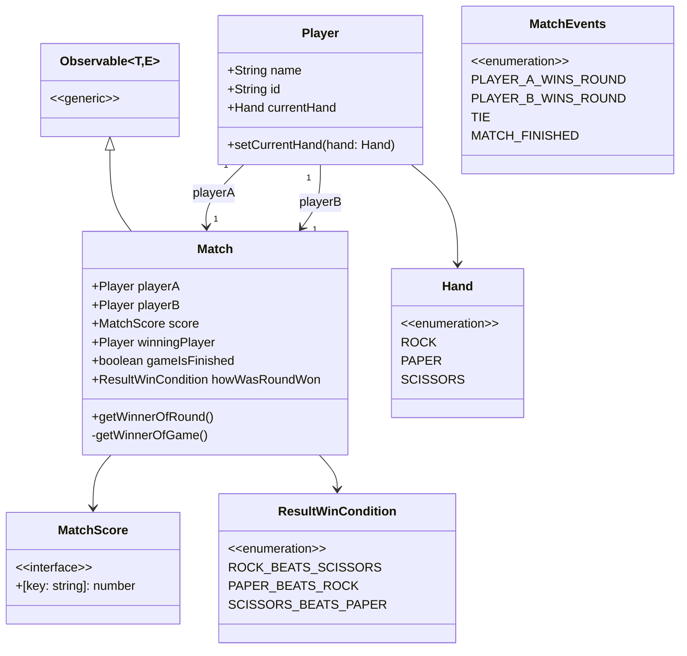

# rock-paper-scissors model (TypeScript)

## class diagram/design of object oriented model
the idea is for the model/design to be fairly simple and not overly verbose, so you can easily test it and hook into its state using the observer pattern to write your own applications and view layers, e.g: web gui/CLI gui or a web socket application etc.

## running:

### install typescript

`npm i`

### run command line simulation

`npm run start-cmd-line-simulation`

